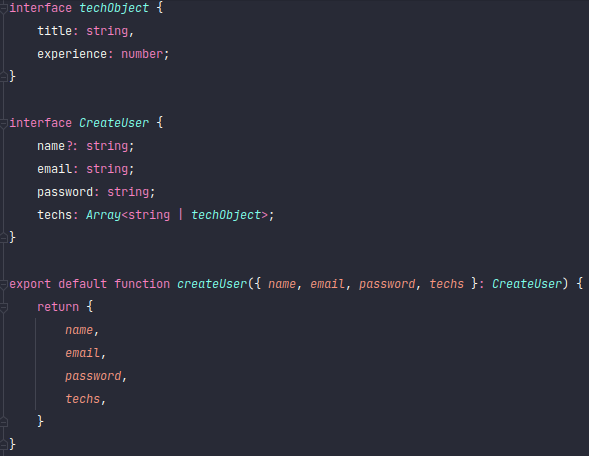
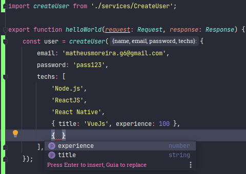

<h1 align="center">NodeJS com TypeScript</h1>

## Dependências

- express
- typescript
- @type/express

## Iniciando projeto

- `yarn tsc --init`
- `yarn tsc`
- `yarn dev`

## Tipos

- any;
- string;
- number;
- boolean;
- object;
- array;

## Criação de interfaces

É uma forma de definir a tipagem de um conjunto de dados.

